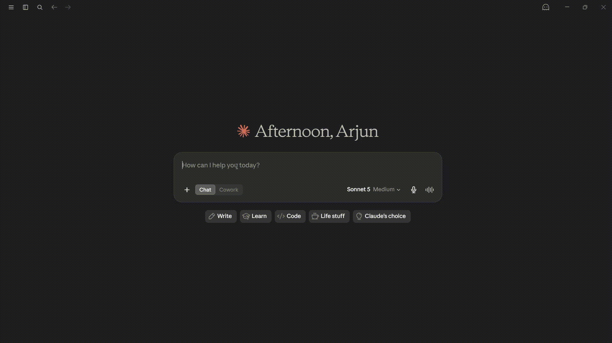
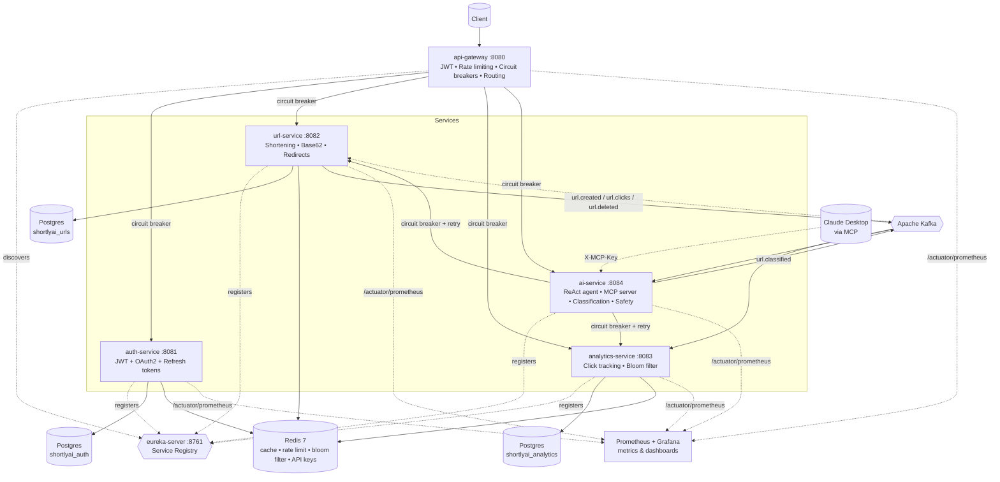
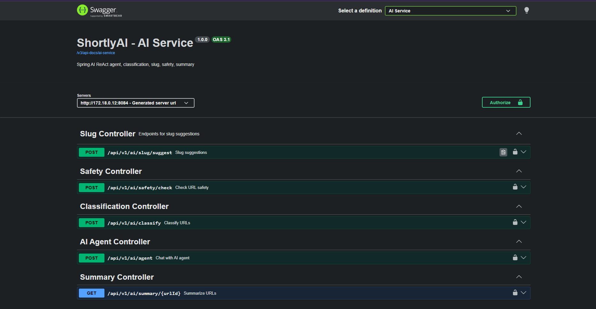
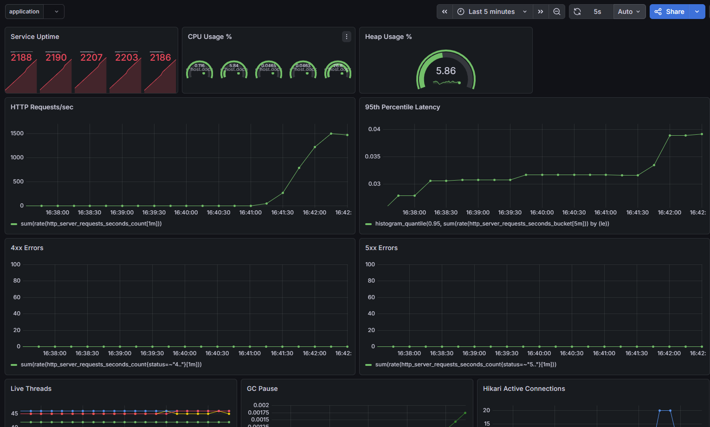

# 🔗 ShortlyAI

**A production-grade URL shortener built as a Java 25 / Spring Boot 4 microservices platform with a built-in AI agent you can just *talk* to, and an MCP server so Claude can manage your links directly.**

> Most URL shortener projects are a single Spring Boot app with one table.
> This one is six independently deployable services with service discovery, circuit breakers, a full observability stack, an LLM-powered ReAct agent that can shorten, inspect, analyze, and delete your links through plain English, and a native MCP server so Claude Desktop can do the same - all spun up with a single `docker compose up`.

⭐ **If this saves you a weekend of wiring microservices together, a star helps a lot and tells me to keep building.**

[](#)
[](#)
[](#)
[](#)
[](#)
[](#)
[](#)
[](#)
[](#)
[](#)
[](#)
[](#)
[](#)
[](https://github.com/SNagarjuna07/shortlyai/actions/workflows/ci.yml)
[](LICENSE)

## 🎬 Demo

> Claude AI MCP walkthrough


---

## 📑 Table of Contents

- [Load Test Results](#-load-test-results)
- [Talk to Your Links (AI Agent)](#-talk-to-your-links)
- [Use it from Claude Desktop (MCP)](#-use-it-from-claude-desktop-mcp)
- [Architecture](#️-architecture)
- [One Command, Full Stack](#-one-command-full-stack)
- [API Docs (Swagger)](#-api-docs-swaggeropenapi)
- [Key Features](#-key-features)
- [Observability](#-observability)
- [Resilience](#️-resilience)
- [Tech Stack](#️-tech-stack)
- [Services at a Glance](#-services-at-a-glance)
- [Project Structure](#-project-structure)
- [Project Status](#️-project-status)
- [Engineering Highlights](#-engineering-highlights)
- [License](#-license)

---

## ⚡ Load Test Results

Benchmark on the redirect hot path (`GET /r/{slug}`)  cache-aside Redis, single local machine running all 15 Docker containers simultaneously. Tested with [k6](https://k6.io).

| VUs | RPS       | Avg Latency | p95       | Errors |
|-----|-----------|-------------|-----------|--------|
| 50  | 342       | 20 ms       | 48 ms     | 0%     |
| 100 | 681       | 19 ms       | 44 ms     | 0%     |
| 200 | **1,332** | **24 ms**   | **62 ms** | **0%** |
| 500 | 1,576     | 163 ms      | 383 ms    | 0%     |
| 700 | 1,259     | 346 ms      | 817 ms    | 0%     |

**284,485 total requests. 0 failures. 0 dropped connections.**

The system peaks at **~1,576 req/s at 500 VUs** then degrades gracefully. Latency climbs but the error rate stays flat at zero. That's backpressure working correctly (connection pool queuing), not a crash. At the realistic sweet spot of 200 concurrent users, the redirect path serves **1,332 req/s at 24 ms average latency**, Redis cache-aside doing its job.

> Numbers are from a single-instance, local-machine run with all 15 containers sharing one host. A dedicated Redis + Postgres deployment would push these significantly higher. The more interesting stat is zero errors under 700 VUs. The system slows, it doesn't break.

```text

         /\      Grafana   /‾‾/                                                                                                                                 
    /\  /  \     |\  __   /  /                                                                                                                                  
   /  \/    \    | |/ /  /   ‾‾\                                                                                                                                
  /          \   |   (  |  (‾)  |                                                                                                                               
 / __________ \  |_|\_\  \_____/ 


     execution: local
        script: loadtest.js
        output: -

     scenarios: (100.00%) 1 scenario, 200 max VUs, 2m30s max duration (incl. graceful stop):
              * default: Up to 200 looping VUs for 2m0s over 3 stages (gracefulRampDown: 30s, gracefulStop: 30s)


  █ TOTAL RESULTS 

    checks_total.......: 137017  1136.71665/s
    checks_succeeded...: 100.00% 137017 out of 137017
    checks_failed......: 0.00%   0 out of 137017

    ✓ status is 302

    HTTP
    http_req_duration..............: avg=26.92ms  min=0s       med=18.68ms p(90)=47.37ms  p(95)=65.68ms  p(99)=138.66ms max=1.39s
      { expected_response:true }...: avg=26.92ms  min=0s       med=18.68ms p(90)=47.37ms  p(95)=65.68ms  p(99)=138.66ms max=1.39s
    http_req_failed................: 0.00%  0 out of 137037
    http_reqs......................: 137037 1136.882573/s

    EXECUTION
    iteration_duration.............: avg=131.05ms min=102.29ms med=120.8ms p(90)=153.16ms p(95)=174.94ms p(99)=279.62ms max=1.51s
    iterations.....................: 137017 1136.71665/s
    vus............................: 5      min=3           max=200
    vus_max........................: 200    min=200         max=200

    NETWORK
    data_received..................: 46 MB  377 kB/s
    data_sent......................: 11 MB  92 kB/s
```
---

## 🤖 Talk to your links

ShortlyAI's standout feature is `ai-service` - a [Spring AI](https://spring.io/projects/spring-ai) ReAct agent that turns plain-English requests into real actions across the platform.

```
POST /api/v1/ai/agent
{
  "message": "Shorten https://www.github.com and tell me how many clicks it has so far"
}
```

```json
{
  "reply": "The shortened URL for https://www.github.com is http://localhost:8082/G and it currently has 0 clicks."
}
```

Under the hood, the agent reasons step-by-step: it calls a `shortenUrl` tool against `url-service`, gets back a real `urlId`, then chains into `getUrlStats` against `analytics-service`, all without the LLM ever touching a database directly, and without the user ever knowing which microservice did what.

Try also:
- *"What are my top 3 most clicked links?"*
- *"Delete the URL with slug ABC123, I confirm it"*
- *"Is this URL safe: http://verify-paypal-login.xyz"*

**Resilience built in:** if `url-service` or `analytics-service` is down or slow, the agent doesn't crash. Resilience4j circuit breakers trip and the agent replies conversationally:

```json
{
  "reply": "URL shortening is temporarily unavailable. Please try again in a moment."
}
```

---

## 🔌 Use it from Claude Desktop (MCP)

`ai-service` doubles as a native **[MCP](https://modelcontextprotocol.io) server**. Point Claude Desktop at it and manage your shortened URLs without leaving the chat window.

**1. Generate an API key** (one-time, via auth-service):

```
POST /api/v1/auth/apikeys
Authorization: Bearer <your JWT>
{ "name": "Claude Desktop" }
```

You'll get back a `sk_...` key - copy it immediately, it's shown exactly once.

**2. Wire it into Claude Desktop's config:**

```jsonc
{
  "mcpServers": {
    "shortlyai": {
      "command": "npx",
      "args": [
        "mcp-remote",
        "http://localhost:8080/mcp",
        "--header", "X-MCP-Key: sk_your_key_here"
      ]
    }
  }
}
```

> On Windows, wrap the command as `"cmd"` / `["/c", "npx", ...]`.

**3. Tools exposed to Claude:**

| Tool                | What it does                                                        |
|---------------------|---------------------------------------------------------------------|
| `mcp_shortenUrl`    | Shorten a long URL, return the short link + numeric ID              |
| `mcp_getUrlDetails` | Look up a URL's original destination + click count by slug          |
| `mcp_deleteUrl`     | Permanently delete a shortened URL (Claude confirms before calling) |
| `mcp_getUrlStats`   | Click count for a specific URL by ID                                |
| `mcp_getTopUrls`    | Your top-performing links by click count                            |

Auth is API-key based (SHA-256 hashed, validated against Redis on every call) rather than JWT. MCP connections are long-lived and tokens shouldn't expire mid-session. Every tool call is circuit-breaker protected against the same `url-service`/`analytics-service` dependencies the chat agent uses.

---

## 🏗️ Architecture



**Event flow example:** shortening a URL triggers `url.created` → consumed by both `analytics-service` (initializes click counters) and `ai-service` (classifies the URL via LLM, generates a title, runs a safety check) → `ai-service` publishes `url.classified` → consumed back by `url-service` to persist the AI-generated title/category/safety flag. Fully async, fully decoupled - a real SAGA choreography, not a hardcoded call chain.

---

## 🚀 One command, full stack

```bash
git clone https://github.com/SNagarjuna07/shortlyai.git
cd shortlyai
cp .env.example .env
# fill in: DB credentials, Redis password, JWT secret, Groq API key, mail credentials

docker compose up -d --build
```

That's it **15 containers**, fully wired:

| What                                    | URL                                       |
|-----------------------------------------|-------------------------------------------|
| API Gateway (entry point)               | http://localhost:8080                     |
| **Swagger UI (all services, one page)** | http://localhost:8080/swagger-ui.html     |
| Eureka dashboard                        | http://localhost:8761                     |
| Grafana (dashboards)                    | http://localhost:3000 (`admin` / `admin`) |
| Prometheus                              | http://localhost:9090                     |
| Kafka UI                                | http://localhost:8090                     |

All 6 services build from multi-stage Dockerfiles (`eclipse-temurin:25-jdk` → `eclipse-temurin:25-jre`), register with Eureka on startup, and expose `/actuator/prometheus` for metrics scraping out of the box.

**Try it in 10 seconds once it's up:**

```bash
# Register + login (or use OAuth2 Google)
curl -X POST http://localhost:8080/api/v1/auth/register \
  -H "Content-Type: application/json" \
  -d '{"email":"you@example.com","password":"your_password"}'

# Shorten a URL
curl -X POST http://localhost:8080/api/v1/urls \
  -H "Authorization: Bearer <your JWT>" \
  -H "Content-Type: application/json" \
  -d '{"originalUrl":"https://github.com/SNagarjuna07/shortlyai"}'

# Follow the redirect
curl -L http://localhost:8082/r/<slug>
```

---

## 📘 API Docs (Swagger / OpenAPI)

Every service ships full OpenAPI 3.1 docs via [springdoc-openapi](https://springdoc.org/), aggregated into a single Swagger UI at the gateway:

| Service                                | Swagger UI                            |
|----------------------------------------|---------------------------------------|
| **Gateway - aggregated, all services** | http://localhost:8080/swagger-ui.html |
| Auth Service                           | http://localhost:8081/swagger-ui.html |
| URL Service                            | http://localhost:8082/swagger-ui.html |
| Analytics Service                      | http://localhost:8083/swagger-ui.html |
| AI Service                             | http://localhost:8084/swagger-ui.html |


---

## ✨ Key Features

| Category              | What's implemented                                                                                                                                                                       |
|-----------------------|------------------------------------------------------------------------------------------------------------------------------------------------------------------------------------------|
| **AI / LLM**          | ReAct agent (Spring AI + tool calling), AI URL classification (title, category, safety), AI slug suggestions, AI-generated analytics summaries                                           |
| **MCP**               | Native MCP server (`STREAMABLE` transport) exposing URL/analytics tools to Claude Desktop, hashed API-key auth, circuit-breaker-protected tool calls                                     |
| **API Docs**          | OpenAPI 3.1 on every service via springdoc, aggregated single Swagger UI at the gateway                                                                                                  |
| **Auth & Security**   | JWT access/refresh tokens, OAuth2 Google login, BCrypt password hashing, email verification, audit logging, header-based service-to-service auth enforced independently on every service |
| **URL Shortening**    | Base62 encoding, custom slugs, expiry dates, cache-aside Redis caching - **1,332 req/s at 24 ms avg p50 on a single instance**                                                           |
| **Analytics**         | Real-time click counters (Redis), hourly rollups, Bloom-filter click deduplication, per-user top-URLs leaderboard                                                                        |
| **Service Discovery** | Netflix Eureka - all 5 business services self-register; gateway routes via `lb://` for dynamic load balancing                                                                            |
| **Resilience**        | Resilience4j circuit breakers + retries on every cross-service call, with custom fallbacks; DLQ + scheduled retry for failed Kafka publishes                                             |
| **Distributed Jobs**  | ShedLock-coordinated scheduled jobs (expiry cleanup, cache warming, DLQ retry, token cleanup) - safe across multiple instances                                                           |
| **Gateway**           | Spring Cloud Gateway (WebFlux) - central JWT validation, Redis token-bucket rate limiting, per-route circuit breakers, CORS, trace ID propagation                                        |
| **Observability**     | Custom Grafana dashboard, Prometheus metrics across all 6 services, structured JSON logging (Logback + Logstash encoder), MDC trace IDs                                                  |
| **CI/CD**             | GitHub Actions pipeline - parallel per-service test jobs, image build & push to GHCR                                                                                                     |
| **Modern Java**       | Java 25, virtual threads, records for all DTOs/events, sealed types, text blocks for SQL/prompts                                                                                         |

---

## 📊 Observability

Every service exposes a `/actuator/prometheus` endpoint. The included Grafana dashboard is automatically provisioned with `docker compose up` and provides real-time monitoring of the entire microservices ecosystem.

The dashboard includes:

1. **HTTP request rate** - requests processed per second across all services.
2. **95th percentile latency (P95)** - response time distribution under load.
3. **JVM heap usage** - real-time heap memory utilization.
4. **CPU usage** - CPU consumption for each service instance.
5. **Service uptime** - application uptime for all running services.
6. **4xx and 5xx error rates** - client and server errors tracked independently.
7. **Live thread count** - active JVM threads per service.
8. **GC pause time** - garbage collection pause duration.
9. **HikariCP active connections** - active database connection pool usage.


---

## 🛡️ Resilience

Two layers of circuit breakers, both Resilience4j, both Spring Boot 4 native:

- **`ai-service` → `url-service` / `analytics-service`** - `@CircuitBreaker` + `@Retry` + `@TimeLimiter` on `CompletableFuture`-returning ops methods, backed by explicit `readTimeout` on the underlying RestClient (shorter than the TimeLimiter window) so cancellation is real, not just cosmetic. 4xx responses pass through untouched; connection failures and 5xx trip the breaker and trigger a friendly fallback the agent relays in plain English.
- **`api-gateway` → all 4 downstream services** - declarative `CircuitBreaker` route filters per service, with per-service-tuned thresholds (LLM-backed `ai-service` gets longer slow-call/timeout windows than CRUD services) and a dedicated `FallbackController` returning structured `503` JSON instead of hangs or raw stack traces.

---

## 🛠️ Tech Stack

| Layer                 | Technology                                                                         |
|-----------------------|------------------------------------------------------------------------------------|
| Language / Runtime    | Java 25 (virtual threads enabled)                                                  |
| Framework             | Spring Boot 4, Spring Cloud Gateway, Spring Security 7                             |
| Service Discovery     | Netflix Eureka (Spring Cloud)                                                      |
| AI                    | Spring AI 2.0.0-M6, ReAct tool-calling agent, MCP server, Groq                     |
| API Docs              | springdoc-openapi 3 (OpenAPI 3.1, Swagger UI, gateway-aggregated)                  |
| Database              | PostgreSQL 16 + Liquibase migrations                                               |
| Cache / Rate Limiting | Redis 7 (RedisBloom module)                                                        |
| Messaging             | Apache Kafka                                                                       |
| Build                 | Maven (multi-module)                                                               |
| Containerization      | Docker + Docker Compose (15-container stack)                                       |
| Resilience            | Resilience4j (`resilience4j-spring-boot4`, Spring Cloud Circuit Breaker), ShedLock |
| Logging               | SLF4J + Logback + Logstash JSON encoder, Loki + Promtail                           |
| Metrics               | Micrometer + Prometheus + Grafana                                                  |
| CI/CD                 | GitHub Actions, GHCR                                                               |
| Load Testing          | k6                                                                                 |

---

## 📡 Services at a Glance

| Service             | Port | Responsibility                                                                                             |
|---------------------|------|------------------------------------------------------------------------------------------------------------|
| `eureka-server`     | 8761 | Service registry - all 5 services below register here                                                      |
| `api-gateway`       | 8080 | Single entry point - JWT validation, rate limiting, circuit breakers, routing, CORS, aggregated Swagger UI |
| `auth-service`      | 8081 | Registration, login, JWT/refresh tokens, OAuth2 Google, email verification, MCP API keys                   |
| `url-service`       | 8082 | URL shortening, Base62 slugs, redirects, cache-aside Redis, Kafka event publishing                         |
| `analytics-service` | 8083 | Kafka consumer for click events, Bloom-filter dedup, real-time + hourly analytics                          |
| `ai-service`        | 8084 | ReAct agent, MCP server, AI URL classification, slug suggestions, safety checks, summaries                 |

---

## 📂 Project Structure

```
shortlyai/
├── docker-compose.yml       # full 15-container stack
├── prometheus.yml
├── promtail-config.yml
├── grafana/provisioning/    # auto-provisioned datasource + dashboard
├── eureka-server/
├── api-gateway/             # routing, auth, rate limiting, circuit breakers, Swagger aggregation
├── auth-service/            # JWT + OAuth2 + refresh tokens + MCP API keys
├── url-service/
│   └── src/main/java/com/shortlyai/url/
│       ├── shortening/      # Base62, core CRUD
│       ├── redirect/        # Public redirect endpoint
│       ├── expiry/          # Scheduled cleanup
│       ├── consumer/        # Consumes AI classification results
│       ├── dlq/             # Dead-letter-queue retry
│       └── events/          # Kafka event records
├── analytics-service/       # Click tracking, Bloom filter, rollups
└── ai-service/
    └── src/main/java/com/shortlyai/ai/
        ├── agent/           # ChatClient + @Tool methods (circuit-breaker protected)
        ├── mcp/             # MCP server tools + API key auth filter
        ├── classification/  # AI title/category/safety pipeline
        ├── slug/            # AI slug suggestions
        └── summary/         # AI-generated analytics summaries
```

Every service follows **feature-based packaging** - each feature folder contains its own controller, service, repository, and DTOs. No layer-based `controllers/`, `services/`, `repositories/` folders.

---

## 🗺️ Project Status

- [x] `eureka-server` - service discovery for all 5 business services
- [x] `auth-service` - JWT, OAuth2 Google, refresh tokens, audit logging, MCP API keys
- [x] `url-service` - shortening, redirects, cache-aside, Kafka events, DLQ retry
- [x] `analytics-service` - click tracking, Bloom filter dedup, hourly rollups, per-user leaderboard
- [x] `api-gateway` - JWT validation, rate limiting, routing, CORS, circuit breakers, aggregated Swagger UI
- [x] `ai-service` - ReAct agent, AI classification pipeline, slug/safety/summary endpoints
- [x] MCP server - tested end-to-end with Claude Desktop via `mcp-remote`
- [x] OpenAPI / Swagger UI - every service, aggregated at the gateway
- [x] Full Docker containerization - 15 containers, single `docker compose up`
- [x] Observability - Prometheus + custom Grafana dashboard
- [x] Resilience4j circuit breakers - gateway-level + AI-agent-level + MCP-level, with fallbacks
- [x] CI pipeline - GitHub Actions, parallel per-service tests + GHCR image push
- [x] Load tested - 1,576 req/s peak, 0 errors across 284k requests, single instance
---

## 🧠 Engineering Highlights

- **Event-driven SAGA choreography** - URL creation triggers a chain of independent Kafka consumers (analytics initialization, AI classification, result persistence) with no central orchestrator. A real choreography pattern, not a distributed monolith.

- **TimeLimiter done correctly** - `@TimeLimiter` wraps `CompletableFuture`-returning ops methods (the only way the aspect actually fires). The underlying RestClient has an explicit `readTimeout` shorter than the TimeLimiter window because `CompletableFuture.cancel()` per JDK Javadoc does not interrupt the running task. Without a real socket timeout, "cancellation" is cosmetic. Both layers are present.

- **Cross-service contract discipline** - every Kafka event and REST DTO is a Java record. Field-name mismatches across service boundaries are a real class of bug this project surfaced, debugged, and enforced against.

- **AI as tool-calling orchestrator, not a black box** - the LLM never touches infrastructure directly. It calls typed `@Tool` methods that hit real microservices. `ToolContext` (chat agent) and a `ThreadLocal`-scoped security context (MCP) keep user identity completely out of the LLM's input/output.

- **Defense-in-depth auth** - gateway validates JWTs once, but every downstream service independently validates the `X-User-Id` header it receives. No service is an open door even if reached directly, bypassing the gateway.

- **Guaranteed delivery without a managed DLQ** - failed Kafka publishes are persisted to a Postgres `failed_events` table and retried on a ShedLock-coordinated schedule, surviving broker outages without requiring a managed Kafka cluster with DLQ topic support.

- **Real load numbers** - 284,485 requests at peak, 0 failures, benchmarked with k6. The redirect hot path sustains 1,332 req/s at 24 ms average latency on a single local instance under 200 concurrent users. Latency climbs under overload (500+ VUs) but error rate stays zero, graceful degradation, not collapse.

---

## 📄 License

MIT - see [LICENSE](LICENSE)

---
## 👤 Author

Built by **S Nagarjuna** as a portfolio project targeting production-grade microservices practices.

- LinkedIn: [s-nagarjuna](https://linkedin.com/in/s-nagarjuna)

⭐ **Found this useful, interesting, or just well over-engineered for a URL shortener? Star the repo, it genuinely helps and costs you two seconds.**