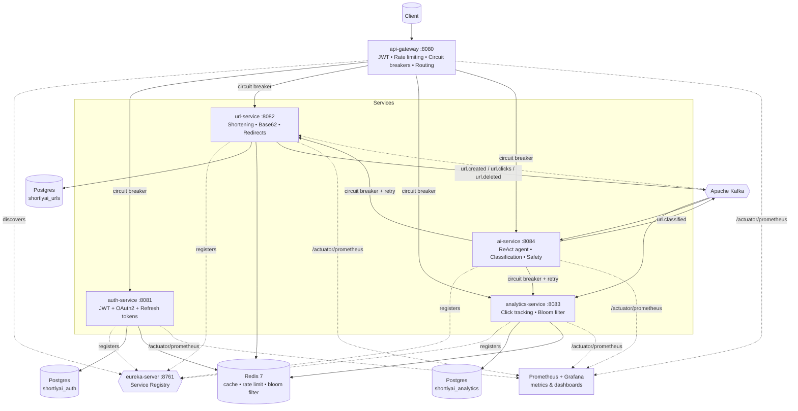

# 🔗 ShortlyAI

**A production-grade URL shortener built as a Java 25 / Spring Boot 4 microservices platform, with a built-in AI agent you can just *talk* to.**

> Most URL shortener projects are a single Spring Boot app with one table.
> This one is six independently deployable services with service discovery, circuit breakers, a full observability stack, and an LLM-powered ReAct agent that can shorten, inspect, analyze, and delete your links through plain English - all spun up with a single `docker compose up`.


---

## 🤖 Talk to your links

ShortlyAI's standout feature is `ai-service` — a [Spring AI](https://spring.io/projects/spring-ai) ReAct agent that turns plain-English requests into real actions across the platform.

```
POST /api/v1/ai/agent
{
  "message": "Shorten https://www.github.com and tell me how many clicks it has so far"
}
```

```json
{
  "reply": "The shortened URL for https://www.github.com is http://localhost:8082/G and it currently has 0 clicks."
}
```

Under the hood, the agent reasons step-by-step: it calls a `shortenUrl` tool against `url-service`, gets back a real `urlId`, then chains into `getUrlStats` against `analytics-service` — all without the LLM ever touching a database directly, and without the user ever knowing which microservice did what.

Try also:
- *"What are my top 3 most clicked links?"*
- *"Delete the URL with slug ABC123, I confirm it"*
- *"Is this URL safe: http://verify-paypal-login.xyz"*

**Resilience built in:** if `url-service` or `analytics-service` is down or slow, the agent doesn't crash — Resilience4j circuit breakers trip and the agent replies conversationally:

```json
{
  "reply": "URL shortening is temporarily unavailable. Please try again in a moment."
}
```

---

## 🏗️ Architecture



**Event flow example:** shortening a URL triggers `url.created` → consumed by both `analytics-service` (initializes click counters) and `ai-service` (classifies the URL via LLM, generates a title, runs a safety check) → `ai-service` publishes `url.classified` → consumed back by `url-service` to persist the AI-generated title/category/safety flag. Fully async, fully decoupled — a real SAGA choreography, not a hardcoded call chain.

---

## 🚀 One command, full stack

```bash
git clone https://github.com/SNagarjuna07/shortlyai.git
cd shortlyai
cp .env.example .env
# fill in: DB credentials, Redis password, JWT secret, Groq API key, mail credentials

docker compose up -d --build
```

That's it - **15 containers**, fully wired:

| What | URL |
|---|---|
| API Gateway (entry point) | http://localhost:8080 |
| Eureka dashboard | http://localhost:8761 |
| Grafana (dashboards) | http://localhost:3000 (`admin` / `admin`) |
| Prometheus | http://localhost:9090 |
| Kafka UI | http://localhost:8090 |

All 6 services build from multi-stage Dockerfiles (`eclipse-temurin:25-jdk` → `eclipse-temurin:25-jre`), register with Eureka on startup, and expose `/actuator/prometheus` for metrics scraping out of the box.

---

## ✨ Key Features

| Category | What's implemented |
|---|---|
| **AI / LLM** | ReAct agent (Spring AI + tool calling), AI URL classification (title, category, safety), AI slug suggestions, AI-generated analytics summaries |
| **Auth & Security** | JWT access/refresh tokens, OAuth2 Google login, BCrypt password hashing, email verification, audit logging, header-based service-to-service auth |
| **URL Shortening** | Base62 encoding, custom slugs, expiry dates, cache-aside Redis caching for sub-millisecond redirects |
| **Analytics** | Real-time click counters (Redis), hourly rollups, Bloom-filter click deduplication, top-URLs leaderboard |
| **Service Discovery** | Netflix Eureka — all 5 business services self-register; gateway routes via `lb://` for dynamic load balancing |
| **Resilience** | Resilience4j circuit breakers + retries on every cross-service call (gateway → all services, AI agent → url/analytics), with custom fallbacks; DLQ + scheduled retry for failed Kafka publishes |
| **Distributed Jobs** | ShedLock-coordinated scheduled jobs (expiry cleanup, cache warming, DLQ retry, token cleanup) — safe across multiple instances |
| **Gateway** | Spring Cloud Gateway (WebFlux) — central JWT validation, Redis token-bucket rate limiting, per-route circuit breakers, CORS, trace ID propagation |
| **Observability** | Custom 7-panel Grafana dashboard (request rate, latency, JVM heap/threads, GC pauses, error rate, circuit breaker state), Prometheus metrics across all 6 services, structured JSON logging (Logback + Logstash encoder), MDC trace IDs, Loki/Promtail log aggregation (WIP) |
| **Modern Java** | Java 25, virtual threads, records for all DTOs/events, sealed types, text blocks for SQL/prompts |

---

## 📊 Observability

Every service exposes `/actuator/prometheus`. The included **Grafana dashboard** (provisioned automatically via `docker compose up`) ships with:

1. **HTTP request rate** — traffic per service
2. **Average latency** — per-service response times

Resilience4j circuit breaker state (`CLOSED` / `OPEN` / `HALF_OPEN`) is also exported as a Prometheus metric per downstream dependency.

---

## 🛡️ Resilience

Two layers of circuit breakers, both Resilience4j, both Spring Boot 4 native:

- **`ai-service` → `url-service` / `analytics-service`** — `resilience4j-spring-boot4` with declarative `@CircuitBreaker` + `@Retry` annotations on every `@Tool` method the ReAct agent uses. 4xx responses (e.g. "URL not found") pass through untouched; connection failures and 5xx trip the breaker and trigger a friendly fallback the agent relays in plain English.
- **`api-gateway` → all 4 downstream services** — declarative `CircuitBreaker` route filters per service, with a dedicated `FallbackController` returning structured `503` JSON instead of hangs or raw stack traces.

---

## 🛠️ Tech Stack

| Layer | Technology |
|---|---|
| Language / Runtime | Java 25 (virtual threads enabled) |
| Framework | Spring Boot 4, Spring Cloud Gateway, Spring Security 7 |
| Service Discovery | Netflix Eureka (Spring Cloud) |
| AI | Spring AI 2.0, ReAct tool-calling agent, OpenAI-compatible LLM (Groq) |
| Database | PostgreSQL 16 + Liquibase migrations |
| Cache / Rate Limiting | Redis 7 (RedisBloom module) |
| Messaging | Apache Kafka |
| Build | Maven (multi-module) |
| Containerization | Docker + Docker Compose (15-container stack) |
| Resilience | Resilience4j (`resilience4j-spring-boot4`, Spring Cloud Circuit Breaker), ShedLock |
| Logging | SLF4J + Logback + Logstash JSON encoder, Loki + Promtail |
| Metrics | Micrometer + Prometheus + Grafana |

---

## 📡 Services at a Glance

| Service | Port | Responsibility |
|---|---|---|
| `eureka-server` | 8761 | Service registry — all 5 services below register here |
| `api-gateway` | 8080 | Single entry point — JWT validation, rate limiting, circuit breakers, routing, CORS |
| `auth-service` | 8081 | Registration, login, JWT/refresh tokens, OAuth2 Google, email verification |
| `url-service` | 8082 | URL shortening, Base62 slugs, redirects, cache-aside Redis, Kafka event publishing |
| `analytics-service` | 8083 | Kafka consumer for click events, Bloom-filter dedup, real-time + hourly analytics |
| `ai-service` | 8084 | ReAct agent, AI URL classification, slug suggestions, safety checks, summaries |

---

## 📂 Project Structure

```
shortlyai/
├── docker-compose.yml     # full 15-container stack: app services + infra + observability
├── prometheus.yml
├── promtail-config.yml
├── grafana/provisioning/   # auto-provisioned datasource + dashboard
├── eureka-server/          # Spring Cloud Netflix Eureka registry
├── api-gateway/            # Spring Cloud Gateway — routing, auth, rate limiting, circuit breakers
├── auth-service/           # JWT + OAuth2 + refresh tokens
├── url-service/            # Shortening, redirects, Kafka events, DLQ
│   └── src/main/java/com/shortlyai/url/
│       ├── shortening/    # Base62, core CRUD
│       ├── redirect/      # Public redirect endpoint
│       ├── expiry/        # Scheduled cleanup
│       ├── classification/# Consumes AI classification results
│       ├── dlq/            # Dead-letter-queue retry
│       └── events/         # Kafka event records
├── analytics-service/    # Click tracking, Bloom filter, rollups
├── ai-service/           # ReAct agent + AI classification/slug/safety/summary
│   └── src/main/java/com/shortlyai/ai/
│       ├── agent/          # ChatClient + @Tool methods (circuit-breaker protected)
│       ├── classification/ # AI title/category/safety pipeline
│       ├── slug/           # AI slug suggestions
│       ├── safety/         # Phishing/scam URL analysis
│       └── summary/        # AI-generated analytics summaries
└── (every service)/Dockerfile   # multi-stage: eclipse-temurin:25-jdk → 25-jre
```

Every service follows **feature-based packaging** (not layer-based) — each feature folder contains its own controller, service, repository, and DTOs.

---

## 🗺️ Project Status

- [x] `eureka-server` — service discovery for all 5 business services
- [x] `auth-service` — JWT, OAuth2 Google, refresh tokens, audit logging
- [x] `url-service` — shortening, redirects, cache-aside, Kafka events, DLQ retry
- [x] `analytics-service` — click tracking, Bloom filter dedup, hourly rollups
- [x] `api-gateway` — JWT validation, rate limiting, routing, CORS, circuit breakers
- [x] `ai-service` — ReAct agent, AI classification pipeline, slug/safety/summary endpoints
- [x] Full Docker containerization — 6 services + Postgres/Redis/Kafka/Eureka, single `docker compose up`
- [x] Observability — Prometheus + custom Grafana dashboard (7 panels)
- [x] Resilience4j circuit breakers — gateway-level + AI-agent-level, with fallbacks
- [ ] Per-tier rate limiting (FREE/PRO/ADMIN)
- [ ] MCP server exposure for ShortlyAI tools

---

## 🧠 Engineering Highlights

A few things this project specifically exercises that a typical CRUD app doesn't:

- **Event-driven SAGA choreography** — URL creation triggers a chain of independent Kafka consumers (analytics initialization, AI classification, result persistence) with no central orchestrator
- **Cross-service contract discipline** — every Kafka event and REST DTO is a Java record; field-name mismatches across service boundaries are a real, recurring class of bug this project surfaced and fixed
- **AI as a tool-calling orchestrator, not a black box** — the LLM never touches infrastructure directly; it calls typed `@Tool` methods that hit real microservices, with `ToolContext` keeping user identity out of the LLM's hands entirely
- **Resilient AI agent** — every tool call is circuit-breaker + retry protected; a downstream outage degrades to a friendly conversational message instead of a stack trace
- **Defense-in-depth auth** — gateway validates JWTs once, but each downstream service independently validates the `X-User-Id` header it receives, so services remain safe even if called directly
- **Guaranteed delivery without a message broker DLQ** — failed Kafka publishes are persisted to a Postgres `failed_events` table and retried on a ShedLock-coordinated schedule, surviving broker outages
- **One-command full-stack deployment** — 6 custom-built microservice images + 9 infrastructure/observability containers, all networked via Docker Compose with service-discovery-aware routing

---

## 📄 License

MIT - see [LICENSE](LICENSE)

## 👤 Author

Built by **S Nagarjuna** as a portfolio project.

⭐ If you found this useful or interesting, consider starring the repo!
