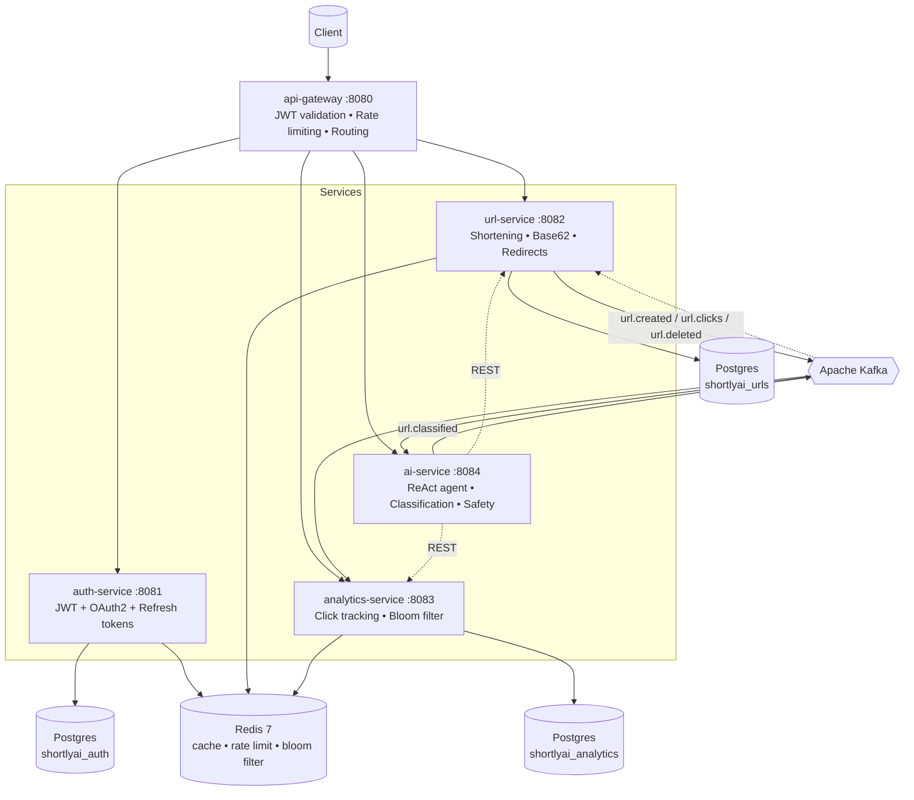

# 🔗 ShortlyAI

**A production-grade URL shortener built as a Java 25 / Spring Boot 4 microservices platform - with a built-in AI agent you can just *talk* to.**

> Most URL shortener projects are a single Spring Boot app with one table.
> This one is five independently deployable services wired together with Kafka, Redis, and an LLM-powered ReAct agent that can shorten, inspect, analyze, and delete your links through plain English.


---

## 🤖 Talk to your links

ShortlyAI's standout feature is `ai-service` - a [Spring AI](https://spring.io/projects/spring-ai) ReAct agent that turns plain-English requests into real actions across the platform.

```
POST /api/v1/ai/agent
{
  "message": "Shorten https://www.github.com and tell me how many clicks it has so far"
}
```

```json
{
  "reply": "The shortened URL for https://www.github.com is http://localhost:8082/G and it currently has 0 clicks."
}
```

Under the hood, the agent reasons step-by-step: it calls a `shortenUrl` tool against `url-service`, gets back a real `urlId`, then chains into `getUrlStats` against `analytics-service` — all without the LLM ever touching a database directly, and without the user ever knowing which microservice did what.

Try also:
- *"What are my top 3 most clicked links?"*
- *"Delete the URL with slug ABC123, I confirm it"*
- *"Is this URL safe: http://verify-paypal-login.xyz"*

---

## 🏗️ Architecture



**Event flow example:** shortening a URL triggers `url.created` → consumed by both `analytics-service` (initializes click counters) and `ai-service` (classifies the URL via LLM, generates a title, runs a safety check) → `ai-service` publishes `url.classified` → consumed back by `url-service` to persist the AI-generated title/category/safety flag. Fully async, fully decoupled — a real SAGA choreography, not a hardcoded call chain.

---

## ✨ Key Features

| Category | What's implemented |
|---|---|
| **AI / LLM** | ReAct agent (Spring AI + tool calling), AI URL classification (title, category, safety), AI slug suggestions, AI-generated analytics summaries |
| **Auth & Security** | JWT access/refresh tokens, OAuth2 Google login, BCrypt password hashing, email verification, audit logging, header-based service-to-service auth |
| **URL Shortening** | Base62 encoding, custom slugs, expiry dates, cache-aside Redis caching for sub-millisecond redirects |
| **Analytics** | Real-time click counters (Redis), hourly rollups, Bloom-filter click deduplication, top-URLs leaderboard |
| **Resilience** | Dead-letter-queue + scheduled retry for failed Kafka publishes, Resilience4j circuit breakers |
| **Distributed Jobs** | ShedLock-coordinated scheduled jobs (expiry cleanup, cache warming, DLQ retry, token cleanup) — safe across multiple instances |
| **Gateway** | Spring Cloud Gateway (WebFlux) — central JWT validation, Redis token-bucket rate limiting, CORS, trace ID propagation |
| **Observability** | Structured JSON logging (Logback + Logstash encoder), MDC trace IDs across all services, Micrometer + Prometheus metrics endpoints *(Grafana/Loki dashboards — WIP)* |
| **Modern Java** | Java 25, virtual threads, records for all DTOs/events, sealed types, text blocks for SQL/prompts |

---

## 🛠️ Tech Stack

| Layer | Technology |
|---|---|
| Language / Runtime | Java 25 (virtual threads enabled) |
| Framework | Spring Boot 4, Spring Cloud Gateway, Spring Security 7 |
| AI | Spring AI 2.0, ReAct tool-calling agent, OpenAI-compatible LLM (Groq) |
| Database | PostgreSQL 16 + Liquibase migrations |
| Cache / Rate Limiting | Redis 7 (RedisBloom module) |
| Messaging | Apache Kafka |
| Build | Maven (multi-module) |
| Containerization | Docker + Docker Compose |
| Resilience | Resilience4j, ShedLock |
| Logging | SLF4J + Logback + Logstash JSON encoder |
| Metrics | Micrometer + Prometheus *(Grafana/Loki — planned)* |

---

## 📡 Services at a Glance

| Service | Port | Responsibility |
|---|---|---|
| `api-gateway` | 8080 | Single entry point — JWT validation, rate limiting, request routing, CORS |
| `auth-service` | 8081 | Registration, login, JWT/refresh tokens, OAuth2 Google, email verification |
| `url-service` | 8082 | URL shortening, Base62 slugs, redirects, cache-aside Redis, Kafka event publishing |
| `analytics-service` | 8083 | Kafka consumer for click events, Bloom-filter dedup, real-time + hourly analytics |
| `ai-service` | 8084 | ReAct agent, AI URL classification, slug suggestions, safety checks, summaries |

---

## 🚀 Getting Started

### Prerequisites
- Java 25 (JDK)
- Maven 3.9+
- Docker + Docker Compose

### 1. Clone the repo
```bash
git clone https://github.com/SNagarjuna07/shortlyai.git
cd shortlyai
```

### 2. Set up environment variables
```bash
cp .env.example .env
# Fill in: DB credentials, Redis password, JWT secret, Groq/OpenAI API key
```

### 3. Start infrastructure (Postgres, Redis, Kafka)
```bash
docker-compose up -d
```

### 4. Run each service
```bash
cd auth-service        && ./mvnw spring-boot:run
cd ../url-service       && ./mvnw spring-boot:run
cd ../analytics-service && ./mvnw spring-boot:run
cd ../ai-service        && ./mvnw spring-boot:run
cd ../api-gateway       && ./mvnw spring-boot:run
```

### 5. Try it
```bash
# Register
curl -X POST http://localhost:8080/api/v1/auth/register \
  -H "Content-Type: application/json" \
  -d '{"email":"you@example.com","password":"yourpassword"}'

# Shorten a URL via the AI agent
curl -X POST http://localhost:8080/api/v1/ai/agent \
  -H "Content-Type: application/json" \
  -H "Authorization: Bearer <your-access-token>" \
  -d '{"message":"Shorten https://www.github.com"}'
```

---

## 📂 Project Structure

```
shortlyai/
├── api-gateway/         # Spring Cloud Gateway — routing, auth, rate limiting
├── auth-service/         # JWT + OAuth2 + refresh tokens
├── url-service/          # Shortening, redirects, Kafka events, DLQ
│   └── src/main/java/com/shortlyai/url/
│       ├── shortening/    # Base62, core CRUD
│       ├── redirect/      # Public redirect endpoint
│       ├── expiry/        # Scheduled cleanup
│       ├── classification/# Consumes AI classification results
│       ├── dlq/            # Dead-letter-queue retry
│       └── events/         # Kafka event records
├── analytics-service/    # Click tracking, Bloom filter, rollups
├── ai-service/           # ReAct agent + AI classification/slug/safety/summary
│   └── src/main/java/com/shortlyai/ai/
│       ├── agent/          # ChatClient + @Tool methods
│       ├── classification/ # AI title/category/safety pipeline
│       ├── slug/           # AI slug suggestions
│       ├── safety/         # Phishing/scam URL analysis
│       └── summary/        # AI-generated analytics summaries
└── docker-compose.yml
```

Every service follows **feature-based packaging** (not layer-based) — each feature folder contains its own controller, service, repository, and DTOs.

---

## 🗺️ Project Status

- [x] `auth-service` — JWT, OAuth2 Google, refresh tokens, audit logging
- [x] `url-service` — shortening, redirects, cache-aside, Kafka events, DLQ retry
- [x] `analytics-service` — click tracking, Bloom filter dedup, hourly rollups
- [x] `api-gateway` — JWT validation, rate limiting, routing, CORS
- [x] `ai-service` — ReAct agent, AI classification pipeline, slug/safety/summary endpoints
- [ ] Observability dashboards (Prometheus + Grafana + Loki)
- [ ] GitHub Actions CI/CD pipeline
- [ ] Per-tier rate limiting (FREE/PRO/ADMIN)
- [ ] MCP server exposure for ShortlyAI tools

---

## 🧠 Engineering Highlights

A few things this project specifically exercises that a typical CRUD app doesn't:

- **Event-driven SAGA choreography** — URL creation triggers a chain of independent Kafka consumers (analytics initialization, AI classification, result persistence) with no central orchestrator
- **Cross-service contract discipline** — every Kafka event and REST DTO is a Java record; field-name mismatches across service boundaries are a real, recurring class of bug this project surfaced and fixed
- **AI as a tool-calling orchestrator, not a black box** — the LLM never touches infrastructure directly; it calls typed `@Tool` methods that hit real microservices, with `ToolContext` keeping user identity out of the LLM's hands entirely
- **Defense-in-depth auth** — gateway validates JWTs once, but each downstream service independently validates the `X-User-Id` header it receives, so services remain safe even if called directly
- **Guaranteed delivery without a message broker DLQ** — failed Kafka publishes are persisted to a Postgres `failed_events` table and retried on a ShedLock-coordinated schedule, surviving broker outages

---

## 📄 License

MIT — see [LICENSE](LICENSE)

## 👤 Author

Built by **S Nagarjuna** as a portfolio project.

⭐ If you found this useful or interesting, consider starring the repo!
